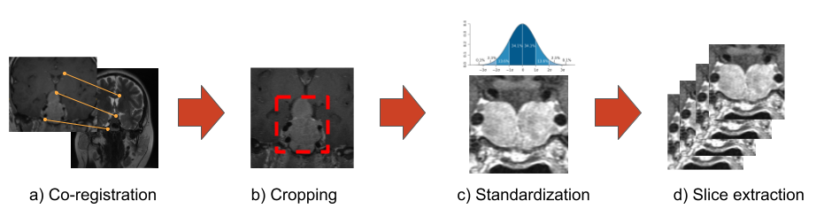
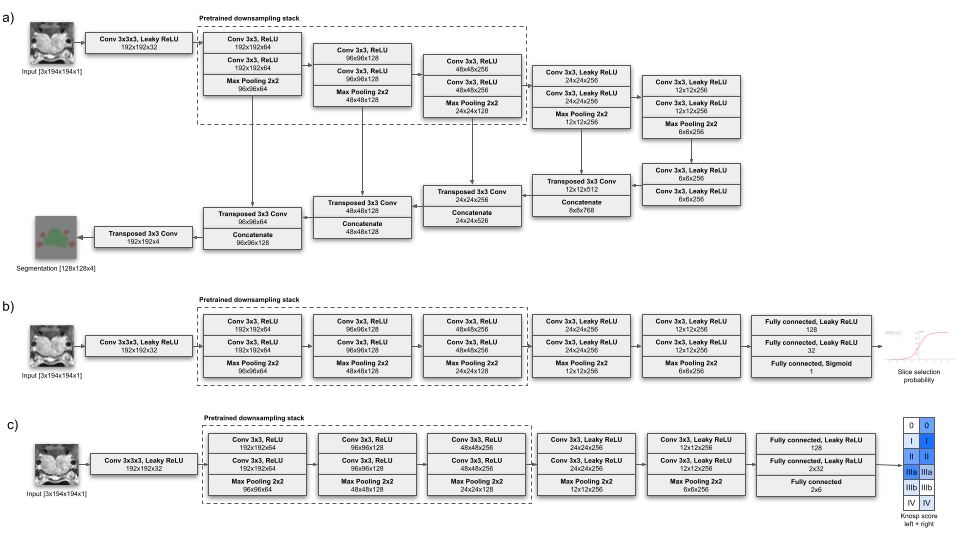
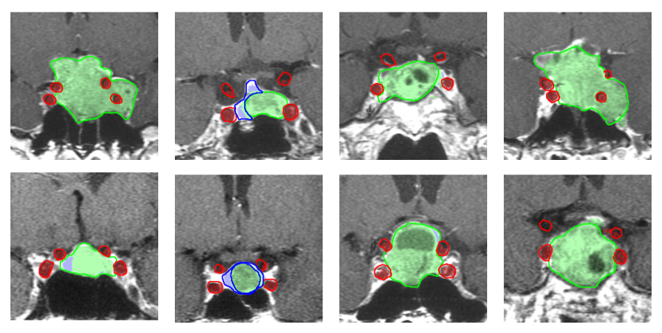

# Fully automated imaging protocol independent system for pituitary adenoma segmentation
This is a code repository accompanying the article **Fully automated imaging protocol independent system for pituitary adenoma segmentation: A Convolutional Neural Network-based model on sparsely annotated MRI** by Cerny M., Kybic J., Majovsky M., Sedlak V., Prigl K., Misiorzova E., Lipina R. & Netuka D.

This program and/or it's parts are not intended for clinical use

## Usage:

pip install -r requirements.txt

python download_example_dataset.py

python 1_create_dataset.py data/config/default.yaml data/example-dataset data/dataset.h5

python 2_train_segmentation.py data/config/default.yaml data/dataset.h5 data/model

python 3_train_slice_selection.py data/config/default.yaml data/dataset.h5 data/model

python 4_visualize.py data/config/default.yaml data/dataset.h5 data/model

python 5_predict.py data/config/default.yaml data/model data/example-dataset/train/1 data/example-dataset/train/1/mask_predicted.nii

Dataset extraction pipeline: a) Images are co-registered and transformed into the CE-T1 coordinate space; b) Centred cropping; c) Patientwise voxel intensity standardisation; and d) Slice extraction for segmented and unsegmented slices

a) Schematic depiction of the segmentation model, where grey boxes signify model layers with layer type and layer output dimensions; the output of the model is a segmentation map with four labels; b) schematic depiction of the slice selection model. The model returns a probability between 0 and 1 of the slice being a relevant slice

Eight examples of ground truth (outline) and predicted (coloured area) segmentations for tumour (green), ICA (red) and normal gland (blue)

**Example dataset**

This project comes with a small example dataset. This is for the purposes of testing the pipeline and adapting it to your own dataset. Our example dataset is too small to train a well generalizing model. Due to the small number of samples, batch size has to be changed to a smaller number (ie. 4) in data/config/default.yaml. All scans in this dataset were acquired with written informed consent form patients.

**Pretrained model**

The pretrained model evaluated in the article is also included with the example dataset.